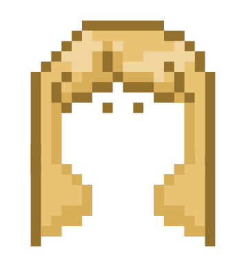
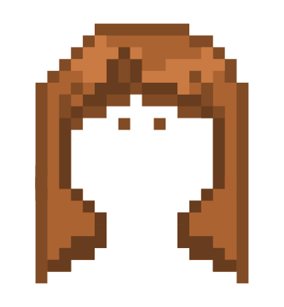
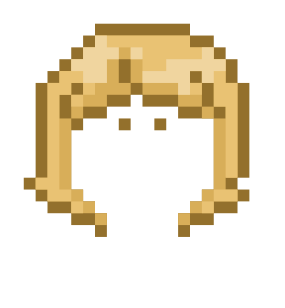
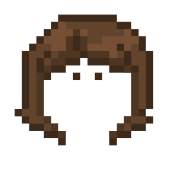
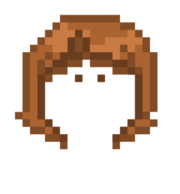

<html lang="en">
<head>
  <meta charset="UTF-8">
  <meta http-equiv="X-UA-Compatible" content="IE=edge">
  <meta name="viewport" content="width=device-width, initial-scale=1.0">
  <link rel="preconnect" href="https://fonts.googleapis.com">
  <link rel="preconnect" href="https://fonts.gstatic.com" crossorigin>
  <link href="https://fonts.googleapis.com/css2?family=Noto+Sans+KR&display=swap" rel="stylesheet">
  
  <title>CODE COUTURE</title>
  <link rel="stylesheet" href="style.css">
  <link rel="stylesheet" href="scroll.css">
  
</head>
<body>
  

    

      <canvas id="base"></canvas>
      <canvas id="shoes"></canvas>
      <canvas id="pants"></canvas>
      <canvas id="shirtbase"></canvas>
      <canvas id="shirt"></canvas>
      <canvas id="eyes"></canvas>
      <canvas id="hair"></canvas>
      <canvas id="hat"></canvas>
      <canvas id="accessories"></canvas>
      <canvas id="blank"></canvas>
      
    

    <audio id="music" src="audio/gametheme.mp3" autoplay loop></audio>
    

      <button id="man-btn" onclick="medskin()">
        
      </button>
      <button id="woman-btn" onclick="lightskin()">
        
      </button>
      <button id="woman-btn" onclick="darkskin()">
        
      </button>
    

  

  

    

      

        <button class="menu-btn" id="body-btn" onclick="menu(0, 'orange', 'rgb(255, 233, 172)')">
          <i class="fas fa-meh-blank fa-4x"></i>
        </button>
      

      

        <button class="menu-btn" id="hat-btn" onclick="menu(1, 'orange', 'rgb(255, 233, 172)')">
          <i class="fab fa-redhat fa-5x"></i>
        </button>
      

      

        <button class="menu-btn" id="shirt-btn" onclick="menu(2, 'orange', 'rgb(255, 233, 172)')">
          <i class="fas fa-tshirt fa-4x"></i>
        </button>
      

      

        <button class="menu-btn" id="pants-btn" onclick="menu(3, 'orange', 'rgb(255, 233, 172)')">
          
        </button>
      

      

        <button class="menu-btn" id="shoes-btn" onclick="menu(4, 'orange', 'rgb(255, 233, 172)')">
          <i class="fas fa-shoe-prints fa-4x"></i>
        </button>
      

    

    

      

        

          

            <h2 class="bodyinfheader">Hair</h2>
            

              

                <i class="fa fa-solid fa-angle-left fa-3x" id="hairbtn-L" onclick="hairbtnL()"></i>
              

              <canvas id="hairDcanvas"></canvas>
              

                <i class="fa fa-solid fa-angle-right fa-3x" id="hairbtn-R" onclick="hairbtnR()"></i>
              

            

            

              
<button id="hairundo" onclick="hairundobtn()">Remove</button>

            

          

          

            <h2 class="bodyinfheader"></h2>
            

              <canvas id="accessoryDcanvas"></canvas>
            

          

        

      

     

        <table>
             <tr>
            <td><button onclick="hairbtn(1)"></button></td>
          </tr>
          <tr>
            <td><button onclick="hairbtn(2)"></button></td>
          </tr>
          <tr>
            <td><button onclick="hairbtn(3)"></button></td>
          </tr>
          <tr>
            <td><button onclick="hairbtn(4)"></button></td>
          </tr>
          <tr>
            <td><button onclick="hairbtn(5)"></button></td>
          </tr>
          <tr>
            <td><button onclick="hairbtn(5)"></button></td>
          </tr>
          <tr>
            <td><button onclick="hairbtn(5)"></button></td>
          </tr>
           <tr>
            <td><button onclick="hairbtn(5)"></button></td>
          </tr>
        </table>
      

      

        <table>
          <tr>
            <td><button onclick="shirtbtn(0)"></button></td>
          </tr>
          <tr>
            <td><button onclick="shirtbtn(1)"></button></td>          
          </tr>
          <tr>
            <td><button onclick="shirtbtn(2)"></button></td>        
          </tr>
          <tr>
            <td><button onclick="shirtbtn(3)"></button></td>           
          </tr>
        </table>
      

      

        <table>
          <tr>
            <td><button onclick="pantsbtn(0)"></button></td>           
          </tr>
          <tr>
            <td><button onclick="pantsbtn(1)"></button></td>          
          </tr>
          <tr>
            <td><button onclick="pantsbtn(2)"></button></td>           
          </tr>
          <tr>
            <td><button onclick="pantsbtn(3)"></button></td>          
          </tr>
          <tr>
            <td><button onclick="pantsbtn(4)"></button></td>          
          </tr>
          <tr>
            <td><button onclick="pantsbtn(5)"></button></td>         
          </tr>
        </table>
      

      

        <table>
          <tr>
            <td><button onclick="shoesbtn(0)"></button></td>
          </tr>
          <tr>
            <td><button onclick="shoesbtn(1)"></button></td>
          </tr>
          <tr>
            <td><button onclick="shoesbtn(2)"></button></td>
          </tr>
          <tr>
            <td><button onclick="shoesbtn(3)"></button></td>
          </tr>
          <tr>
            <td><button onclick="shoesbtn(4)"></button></td>
          </tr>
        </table>
      

  

   <audio id="music" autoplay loop></audio>
    

      

        <button id="man-btn" onclick="changeMusic('audio/gametheme.mp3')">Play Music 1</button>
        <button id="woman-btn" onclick="changeMusic('audio/Popmusic.mp3')">Play Music 2</button>
    

  

  
   

